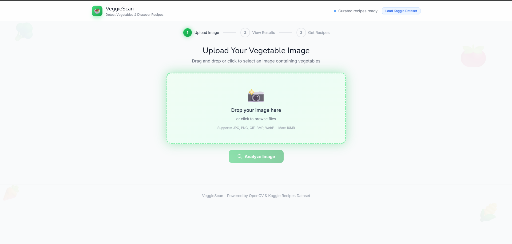
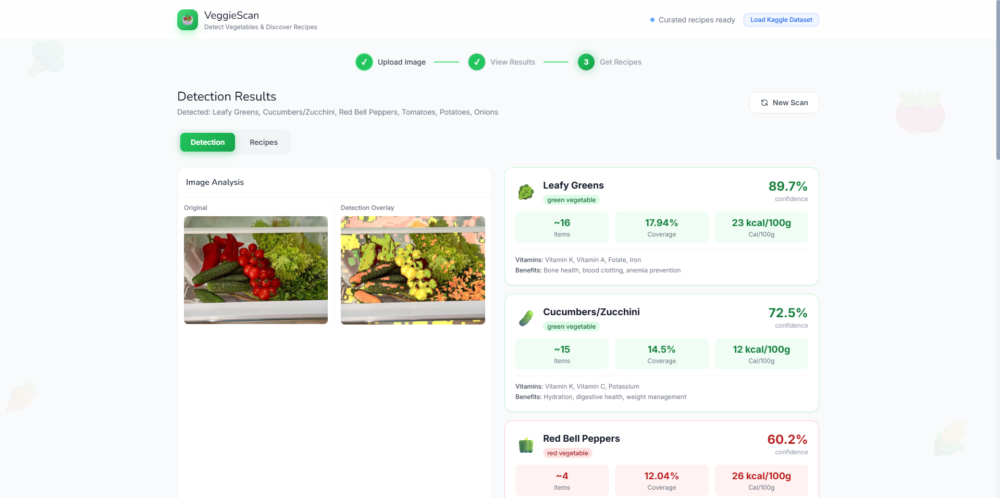
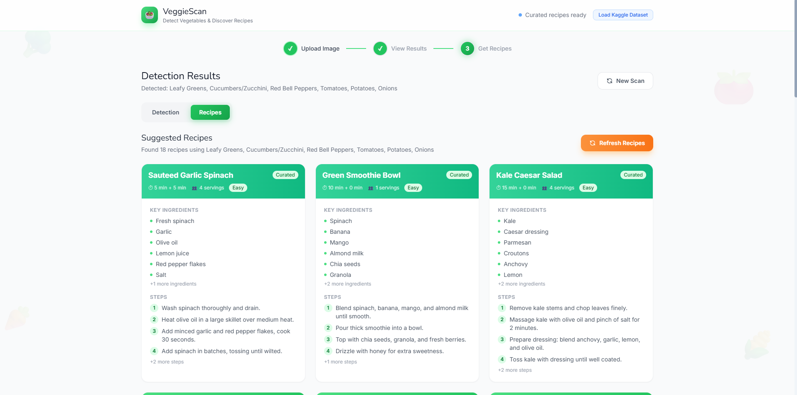

# 🥗 VeggieScan — Vegetable Detection & Recipe Generator

A web-based application that detects vegetables in uploaded images using OpenCV color-space analysis and suggests delicious recipes powered by the Kaggle Food.com dataset (180K+ recipes).


---

## ✨ Features

- **🖼️ Image Upload** — Drag-and-drop or click to upload vegetable images with real-time preview
- **🔍 Vegetable Detection** — Identifies 10 vegetable types using HSV color-space analysis with confidence scores
- **🎨 Visual Overlay** — Generates detection overlays and per-vegetable segmentation masks
- **📖 Recipe Generator** — Suggests recipes from 30 curated recipes + 180K+ Kaggle Food.com recipes
- **🥕 Nutrition Info** — Displays calories, vitamins, and health benefits for each detected vegetable
- **📊 Confidence Analysis** — Animated confidence bars and coverage statistics
- **☁️ Kaggle Integration** — One-click dataset download directly from the UI
- **📱 Responsive Design** — Beautiful, modern UI built with Tailwind CSS

---

## 🚀 Demo


```
1. Upload an image containing vegetables
2. Click "Analyze Image" to detect vegetables
3. View detection results, overlay images, and segmentation masks
4. Switch to "Recipes" tab to discover recipes based on detected vegetables
```

---

## 🛠️ Tech Stack

| Layer         | Technology                          |
|---------------|-------------------------------------|
| **Backend**   | Python, Flask             |
| **Detection** | OpenCV, NumPy                       |
| **Recipes**   | Kaggle Food.com Dataset, Pandas     |
| **Frontend**  | HTML5, Tailwind CSS, Vanilla JS     |
| **Imaging**   | Pillow, Matplotlib                  |

---

## 📦 Installation

### Prerequisites

- Python 3.10 or higher
- pip

### Quick Start

```bash
# Clone the repository
git clone https://github.com/<your-username>/veggiescan.git
cd veggiescan

# Option 1: Use the start script (recommended)
bash start.sh
```

The start script will automatically:
1. Create a Python virtual environment
2. Install all dependencies from `requirements.txt`
3. Launch the server with Gunicorn

### Manual Setup

```bash
# Create virtual environment
python3 -m venv venv
source venv/bin/activate

# Install dependencies
pip install -r requirements.txt

# Create required directories
mkdir -p static/uploads static/results

# Start the server
gunicorn --bind 0.0.0.0:5000 --timeout 120 --workers 1 --threads 4 app:app
```

Then open **http://localhost:5000** in your browser.

---

## 📂 Project Structure

```
veggiescan/
├── app.py                        # Flask application entry point
├── requirements.txt              # Python dependencies
├── start.sh                      # Quick-start script
├── templates/
│   └── index.html                # Main web interface (Tailwind CSS)
├── detector/
│   ├── __init__.py
│   └── vegetable_detector.py     # OpenCV-based vegetable detection
├── recipes/
│   ├── __init__.py
│   └── recipe_generator.py       # Recipe generation with Kaggle dataset
└── static/
    ├── uploads/                  # Uploaded images (auto-created)
    └── results/                  # Detection result images (auto-created)
```

---

## 🥬 Supported Vegetables

| Vegetable          | Emoji | Color Detection | Detection Method       |
|--------------------|-------|-----------------|------------------------|
| Tomatoes           | 🍅    | Red             | HSV hue 0-10, 170-180  |
| Red Bell Peppers   | 🫑    | Red             | HSV hue 0-10           |
| Carrots            | 🥕    | Orange          | HSV hue 10-25          |
| Cucumbers/Zucchini | 🥒    | Green           | HSV hue 35-85          |
| Leafy Greens       | 🥬    | Green           | HSV hue 35-90          |
| Broccoli           | 🥦    | Green           | HSV hue 55-90          |
| Corn               | 🌽    | Yellow          | HSV hue 18-30          |
| Eggplant           | 🍆    | Purple          | HSV hue 100-140        |
| Potatoes           | 🥔    | Brown           | HSV hue 15-30          |
| Onions             | 🧅    | Yellow          | HSV hue 15-30          |

Each detected vegetable includes:
- **Confidence score** — How certain the detection is (0–99%)
- **Coverage** — Percentage of the image occupied
- **Estimated count** — Number of individual items detected
- **Nutrition data** — Calories, vitamins, and health benefits

---

## 🍳 Recipe System

### Curated Recipes (Available Immediately)

The app includes **30 hand-curated recipes** (3 per vegetable) that work without any external dataset:

- Classic Margherita Pizza, Tomato Basil Soup, Fresh Tomato Salsa
- Stuffed Bell Peppers, Roasted Red Pepper Hummus, Red Pepper Pasta
- Honey Glazed Carrots, Carrot Ginger Soup, Carrot Cake
- Cucumber Raita, Zucchini Noodles with Pesto, Stuffed Zucchini Boats
- Sauteed Garlic Spinach, Green Smoothie Bowl, Kale Caesar Salad
- Garlic Roasted Broccoli, Broccoli Cheddar Soup, Beef and Broccoli Stir Fry
- Grilled Mexican Street Corn, Sweet Corn Chowder, Corn Fritters
- Eggplant Parmesan, Baba Ganoush, Moussaka
- Crispy Roasted Potatoes, Creamy Mashed Potatoes, Aloo Gobi
- French Onion Soup, Onion Rings, Caramelized Onion Tart

### Kaggle Food.com Dataset (180K+ Recipes)

Click the **"Load Kaggle Dataset"** button in the app header to download and index the full Food.com Recipes and Interactions dataset from Kaggle. This provides access to over 180,000 community recipes searchable by detected vegetable ingredients.

Dataset: [Food.com Recipes and Interactions](https://www.kaggle.com/datasets/shuyangli94/food-com-recipes-and-user-interactions)

---

## 🔌 API Reference

### Detect Vegetables

```http
POST /api/detect
Content-Type: multipart/form-data

Parameter: image (file) — The vegetable image to analyze
```

**Response:**

```json
{
  "success": true,
  "data": {
    "total_found": 3,
    "original_url": "/results/abc123_original.jpg",
    "overlay_url": "/results/abc123_overlay.jpg",
    "detections": [
      {
        "name": "Tomatoes",
        "confidence": 89.5,
        "coverage": 22.3,
        "count": 3,
        "color": "red",
        "emoji": "🍅",
        "nutrition": {
          "calories": "18 kcal/100g",
          "vitamins": "Vitamin C, Vitamin A, Potassium",
          "benefits": "Heart health, skin protection, antioxidant properties"
        }
      }
    ],
    "mask_visualizations": [
      { "name": "Tomatoes", "mask_url": "/results/abc123_mask_0.jpg" }
    ]
  }
}
```

### Generate Recipes

```http
POST /api/recipes
Content-Type: application/json

Body: { "vegetables": [...] }
```

**Response:**

```json
{
  "success": true,
  "data": {
    "source": "curated",
    "recipes": [
      {
        "name": "Classic Margherita Pizza",
        "source_vegetable": "Tomatoes",
        "source": "curated",
        "ingredients": ["Fresh tomatoes", "Mozzarella cheese", "..."],
        "instructions": ["Slice fresh tomatoes...", "..."],
        "prep_time": "15 min",
        "cook_time": "12 min",
        "servings": 4,
        "difficulty": "Easy"
      }
    ]
  }
}
```

### Check Dataset Status

```http
GET /api/dataset-status
```

### Trigger Kaggle Download

```http
POST /api/download-kaggle
```

### Serve Result Images

```http
GET /results/<filename>
```

---

## ⚙️ How It Works

### Detection Pipeline

1. **Image Ingestion** — Uploaded image is decoded and resized (max 600px) for efficient processing
2. **HSV Conversion** — Image is converted from BGR to HSV color space for robust color detection
3. **Color Masking** — For each vegetable profile, a binary mask is created using HSV range thresholds
4. **Morphological Cleanup** — Masks are cleaned using opening (erosion + dilation) to remove noise
5. **Contour Analysis** — Significant contours are found to estimate the number of vegetable items
6. **Confidence Scoring** — Coverage percentage is scaled to a confidence score (0–99%)
7. **Overlay Generation** — Detection results are blended onto the original image with color-coded masks
8. **Result Serving** — Images are saved to disk and served via URLs; detection data returned as JSON

### Recipe Matching

1. **Curated Recipes** — Directly matched by vegetable name from the built-in recipe database
2. **Kaggle Recipes** — Ingredient keywords are searched in the dataset's `ingredients` column using pandas string matching
3. **Results Merged** — Both sources are combined, with Kaggle recipes marked as `"kaggle"` source and curated as `"curated"`

---

## 📋 Dependencies

```
flask>=3.0.0          # Web framework
flask-cors>=4.0.0     # Cross-origin support
opencv-python-headless>=4.9.0  # Image processing (headless, no GUI)
numpy>=1.26.0         # Numerical computing
matplotlib>=3.8.0     # Plotting & visualization
Pillow>=10.0.0        # Image I/O
kagglehub>=0.2.0      # Kaggle dataset download
pandas>=2.1.0         # Dataset manipulation
requests>=2.31.0      # HTTP client
werkzeug>=3.0.0       # WSGI utilities
gunicorn>=21.0.0      # Production WSGI server
```

---


## 🙏 Acknowledgments

- [OpenCV](https://opencv.org/) — Computer vision library
- [Kaggle / Food.com Dataset](https://www.kaggle.com/datasets/shuyangli94/food-com-recipes-and-user-interactions) — Recipe data
- [Flask](https://flask.palletsprojects.com/) — Lightweight web framework
- [Tailwind CSS](https://tailwindcss.com/) — Utility-first CSS framework
- [kagglehub](https://github.com/Kaggle/kagglehub) — Kaggle dataset access
